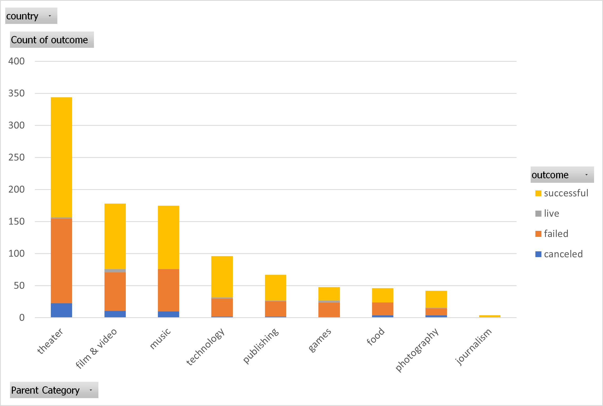
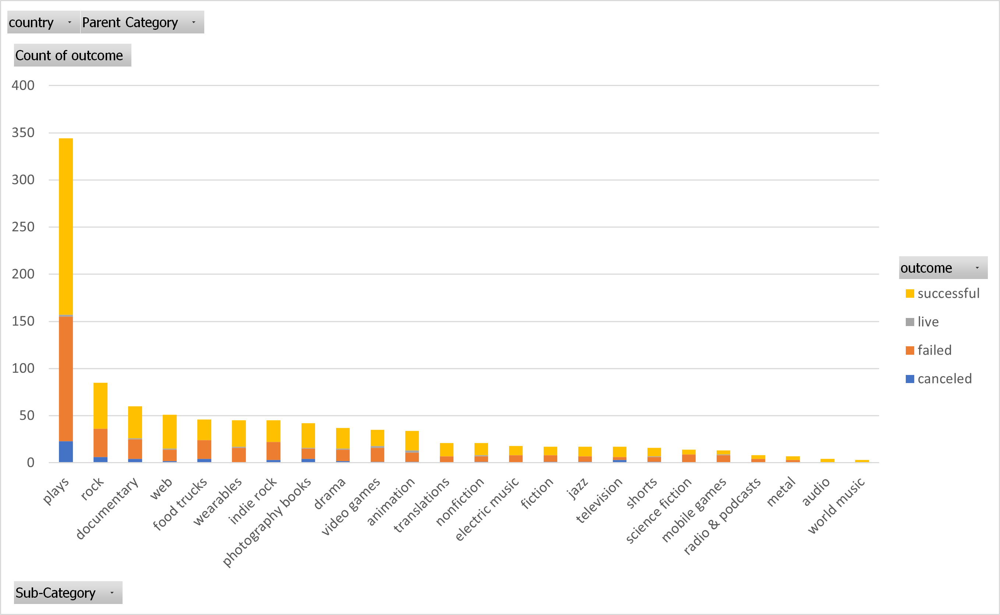
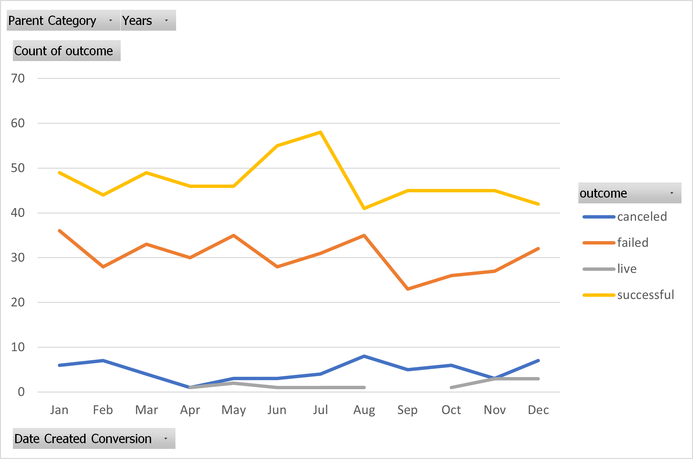
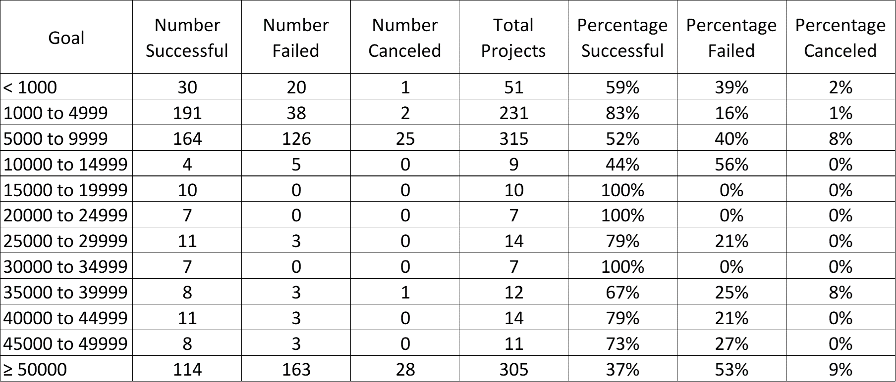
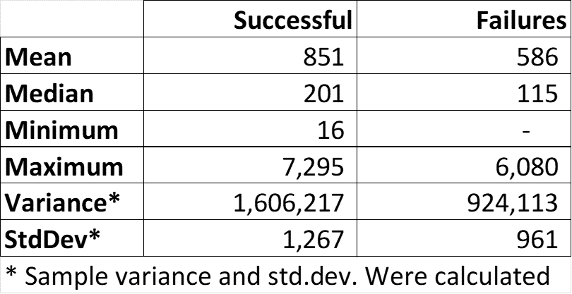
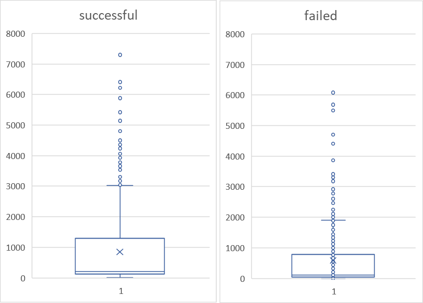

# KickStarter
## Given the provided data, what are three conclusions that we can draw about crowdfunding campaigns?
1.	Campaigns with smaller goals were the most successful, as successful campaigns had an average $26K goal vs $65 for failed campaigns. In average, successful campaigns achieved $50K funding, while failed ones achieved $34K. Campaigns started in June and July seem to be more successful. Most crowdfunding campaigns (57%) reach or exceed their goal, and 36% fail to meet their goals. Maybe one strategy for future campaigns may be to break a project in two or three so each individual part has a smaller dollar goal.
2.	Theater, film & video, and music are the projects with most crowdfunding initiatives, making up 70% of all crowdfunding campaigns. Within these categories, plays, rock, and documentary projects are the most crowdsourced.
3.	The average donation is $67.55 and does not change much for successful or failed projects ($69.43 and $64.11, respectively). Similarly, the average duration for a campaign is 15 days, and this does not change for successful or failed campaigns.
What are some limitations of this dataset?
Not all crowdfunding platforms are included (e.g., Patreon, Crowdfunder, GoFundMe, etc.), thus this sample might be biased. For example, Kickstarter and Indeogogo may be the preferred options for “arts” projects, thus creating the perception that theater, music, and film & video are the most crowdfunded projects. Therefore, based on this data alone we cannot draw conclusions about crowdfunding campaigns in general.
If the main interest is understanding what makes a crowdfunding campaign successful, there the data does not really include information that may allow us to formulate hypotheses, other than the month of the year a campaign is created, and the goal amount for each campaign. 
Data does not include information about the “quality” of the projects, or some measure of market success. We don’t know whether the projects successfully funded had any success in their markets.
What are some other possible tables and/or graphs that we could create, and what additional value would they provide?
I did calculate a few other metrics, such as average goal amount for overall sample, and only for successful and failed projects. I also calculated the average donation, and its breakdown for successful and failed project. Lastly, I created an additional column for “duration of campaign,” where I simply subtracted the start date from the end date. See bottom of source data spreadsheet, and last column. These figures allowed me to make some conclusions listed above in the first question.
## BONUS QUESTIONS
### Use your data to determine whether the mean or the median better summarizes the data.
Median is a better measure of central tendency, due to the many outliers present in the data. The mean is very sensitive to outliers.

### Use your data to determine if there is more variability with successful or unsuccessful campaigns. Does this make sense? Why or why not?
There is less variability in failures than in successful campaigns, as the former had a standard deviation of 1,266 backers, and the latter of 960.
This makes sense to me, as successful campaigns had a higher average goal than failed ones ($26K vs $65), thus generating a wider variability. 

 

# Appendix

 

Figure 1. Count of campaigns by parent category and outcome.

 

Figure 2. Count of campaigns by sub-category and outcome.
 
 

Figure 3. Count of campaigns by month and status.
 
 

Table 1. Bonus 1: Count of campaigns by goal and outcome.
 
 

Figure 4. Bonus 1: Count of campaigns by goal and outcome.
 
 

Table 2. Bonus 2: Descriptive statistics by outcome.
 
 

Figure 5. Bonus 2: Box plot of counts by number of backers.
